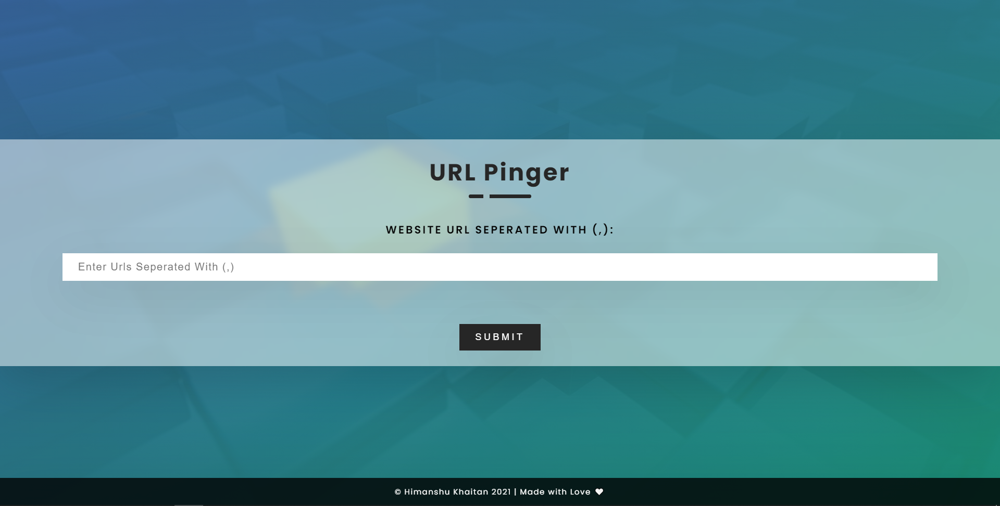

## URL PINGER

***

#### Introduction

***

This is a URL Pinger. Check different parameters like `Host`, `Numerical Host`, `Response Time` and many more.

#### Tech Stack

***

#### Installation

***

Run `npm install` in the root directory of the Project. To use project see following commands:

###### To Start the Server

`npm run start`

###### To Start the Dev Server

`npm run dev`

In both the cases i.e. `npm run start` and `npm run dev` visit `http://localhost:3000/` to view the website.

> Happily turning COFFEE into CODE!